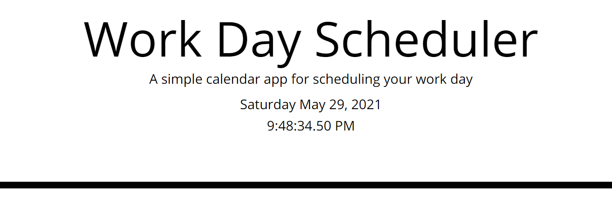
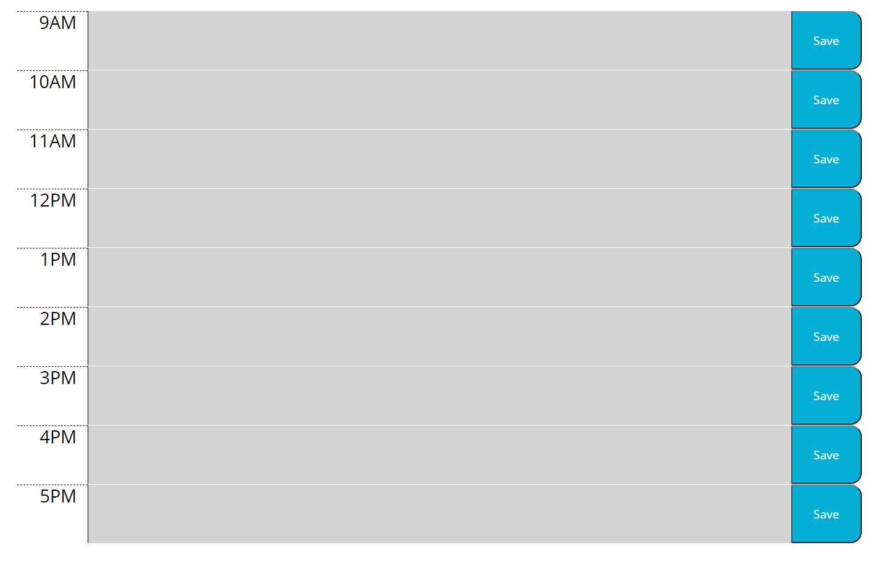
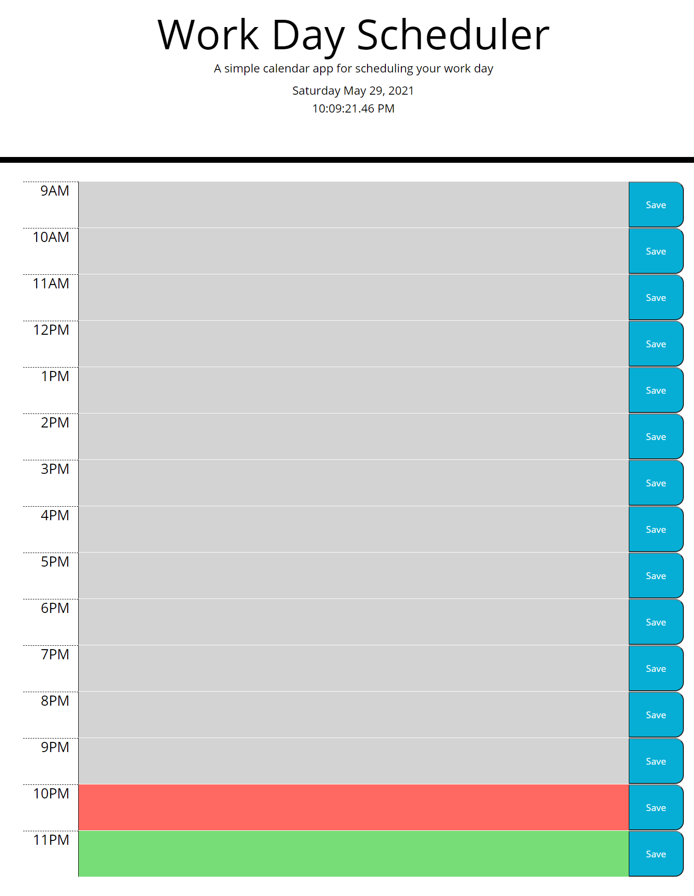
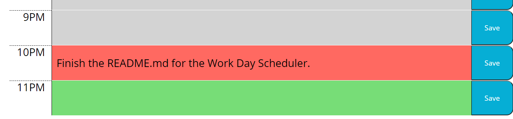
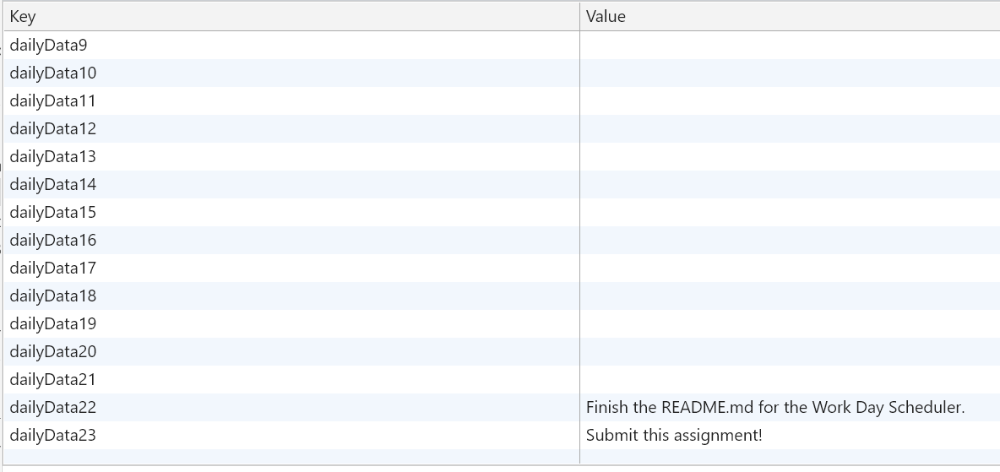
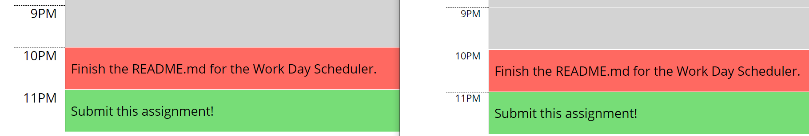
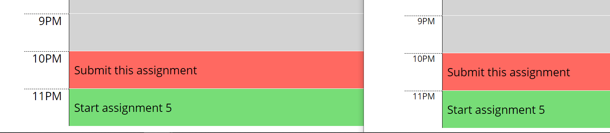

# Work Day Scheduler

## **The Work Day Scheduler**
This simple program is a great way to plan out your day! With an intuitive type and save functionality, it gives the user a quick way to have a way to schedule their day in a rudimentary system!

- The top of the page presents the user with the current day, month, day of the week. The time also displays a dynamic clock, letting you leave it up throughout the day!

- A simple layout allows the user to begin typing in the boxes layed out in rows. 

- The time on the top dictates the color of the boxes, if its grey, the time has elapsed, if its red, the time is current and if the box is green, the time is in the future. The time has been extended to display this capability.

- Typing the text inside the textbox allows you to write down quick notes about the schedule of your day, it looks like I have to finish this README!

- The values for each timing is dynamically added into local storage, even if the user has not entered a value in. The way the code is structured, eliminates the need for error checking. It also allows us to reuse the code structure to include a more dynamic scheduler to include multiple days, months and years giving the dynamic structure.

- Because its saved in local storage, opening the page up again brings up our saved data!

- Finally, the structure of the code allows us to consistently save to local storage without facing indexing issues or worrying about data that may already exist.

# Why it Matters?
Having a daily scheduler is important to remind a person what to complete before days end, and keep them motivated by color coding the slots. The dynamic nature of the code allows future developers to use this as a stepping stone in developing an expanded scheduler to include more days, months or even years. By simply adding more layers into the variable and allowing appropriate naming schemes and loops to denote depths of time, its a flexible base for any future developer!

Visit my work day scheduler [by clicking here](https://brobro10000.github.io/Work-Day-Scheduler) or follow the direct link at [https://brobro10000.github.io/Work-Day-Scheduler](https://brobro10000.github.io/Work-Day-Scheduler). 

## 
We Hope to see you there!
 ##
